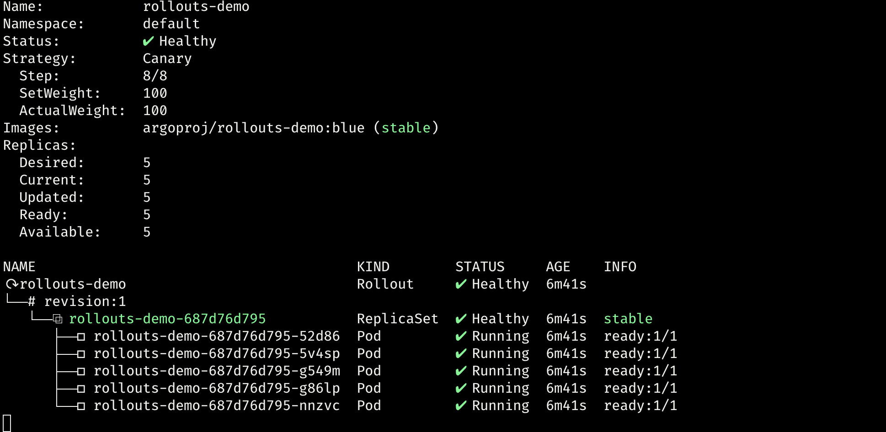
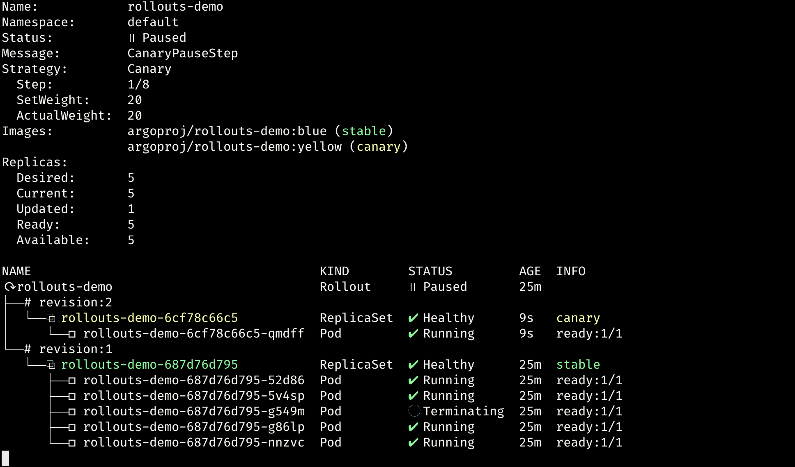
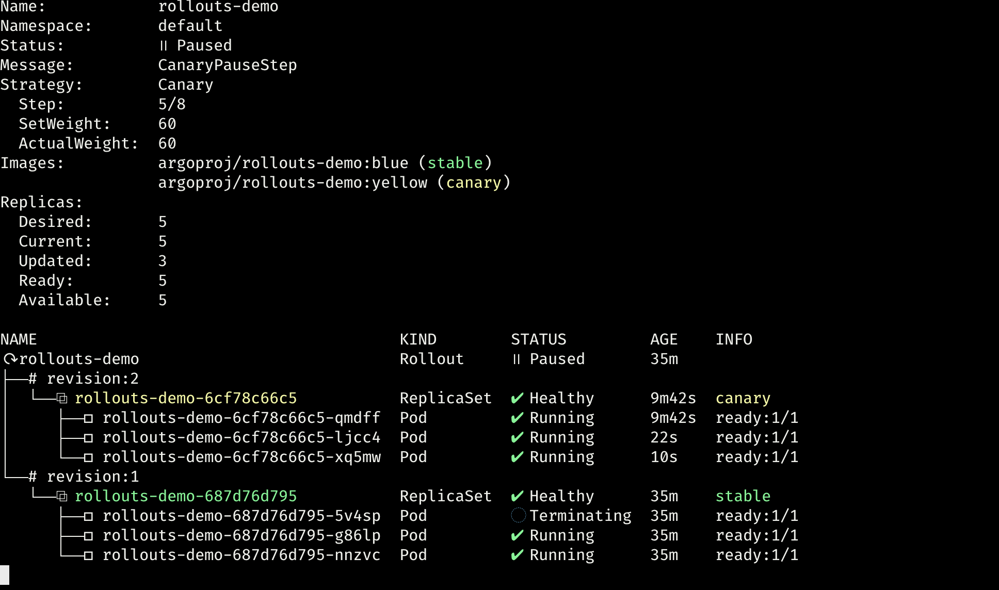
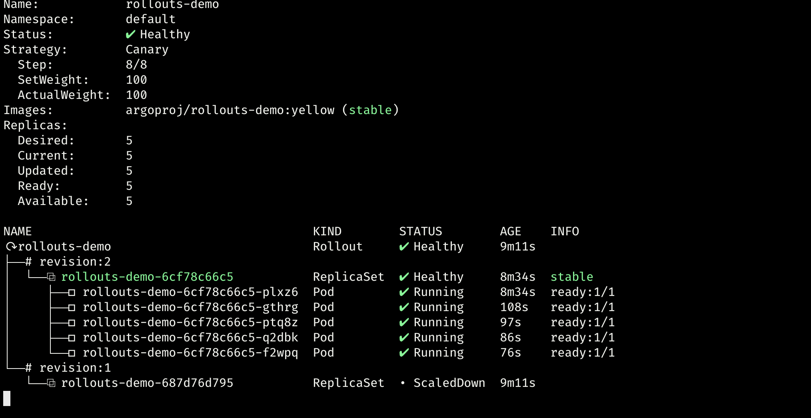
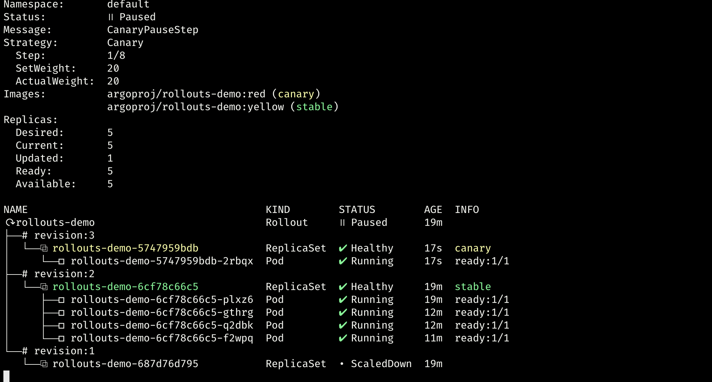
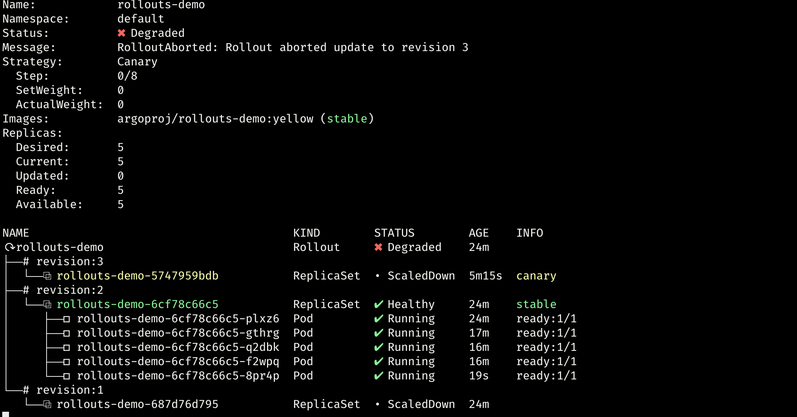
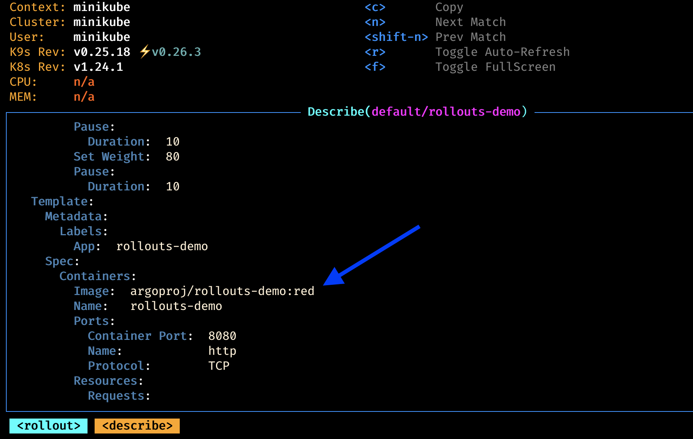
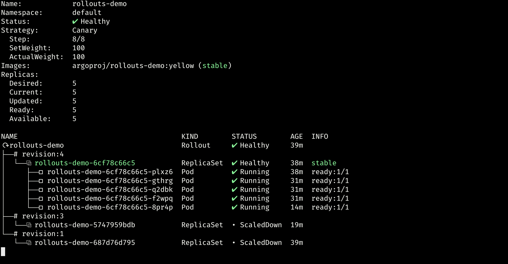

### Getting Started
For this lab we will use [`minikube`](https://minikube.sigs.k8s.io/docs/), therefore in order to spin up your `minikube` cluster have a read at [`this`](../02-minikube-and-requirements/Readme.md#02-minikube-and-requirements) and cover whichever requirement you are currently missing in your environment, if any.

### Controller Installation

Let's install `Argo Rollouts` controller:

```bash 
make argo_rollouts_controller_install
```
---

***Note:*** 
this command will implicitly create the Argo Rollouts namespace having the default naming (i.e. `argo-rollouts`). If you wish to install stuffs within a different namespace name, then modify the [`makefile init target`](Makefile#Makefile) as well as download the installation file [`argo-rollouts install.yaml`](https://github.com/argoproj/argo-rollouts/releases/latest/download/install.yaml) and modify it accordingly.

---

### Kubectl Plugin Installation

On MacOS:
```bash
brew install argoproj/tap/kubectl-argo-rollouts
```

### Make a deployment wrapped with `Rollout`
Let's run the following command to deploy the initial `Rollout` and `Service` targeting the rollout.

```bash
make argo_rollouts_demo_install
```

The initial creations of any Rollout will immediately scale up the replicas to 100% (skipping any canary upgrade steps, etc...) since there was no upgrade that occurred given that we just performed our first deployment for this service.
Let's run this command relying on the kubect plugin installed earlier on:
```bash
kubectl argo rollouts get rollout rollouts-demo --watch
```



Now let's update the `rollout`:
```bash
kubectl argo rollouts set image rollouts-demo \
  rollouts-demo=argoproj/rollouts-demo:yellow
```

During a rollout update, the controller will progress through the steps defined in the Rollout's update strategy. 

```yaml
spec:
  replicas: 5
  strategy:
    canary:
      steps:
      - setWeight: 20
      - pause: {}
      - setWeight: 40
      - pause: {duration: 10}
      - setWeight: 60
      - pause: {duration: 10}
      - setWeight: 80
      - pause: {duration: 10}
```
The example rollout sets a ***20%*** traffic weight to the canary, and pauses the rollout indefinitely until user action is taken  (i.e. `unpause/promote the rollout`). 
In fact after updating the image, watching the rollout we can tell that it reached the paused state:

```yaml
spec:
  replicas: 5
  strategy:
    canary:
      steps:
      - setWeight: 20
      - pause: {} # <--
      - setWeight: 40
      - pause: {duration: 10}
      ...
```


So the deployment state, seen as whole, is that the `rollout` is in a paused state, and now has `1/5 replicas` running the ***new version*** of the pod template, and `4/5 replicas` running the ***previous version***.

Now let's manually promote the `rollout`: 
```bash
kubectl argo rollouts promote rollouts-demo
```
So we can see that after promotion, `rollout` will proceed to execute the remaining steps, in this particular case ***fully automated***, hence with no need to perform any further promotion.
Each step is going to last 10 seconds as declare at `strategy.canary.steps`:


Once the `rollout` completes the procedure we can see that:

- rollouts-demo-6cf78c66c5 (revision:2): Healthy and every pods in its Replica are running
- rollouts-demo-687d76d795 (revision:1): Scaled Down

#### Abort the `Rollout`
Let's see now how to rollback a rollout while updating it.
Change the rollouts image in order to trigger a new version (i.e. revision:1)

```bash
kubectl argo rollouts set image rollouts-demo \
  rollouts-demo=argoproj/rollouts-demo:red
```
Like for the previous deployment the `rollout` paused at the first `step` with a percentage of ***20%*** till we don't promote it then make it going further covering the remaining steps:


Therefore let's imagine we have some issue with the new revision and we need to rollback. Let's do it then :-)

```bash
kubectl argo rollouts abort rollouts-demo
```


As we can see the `rollout` has reinstated the last revision considered `stable` (i.e. revision:2). The `rollouts-demo` has been marked as `Degraded` since the desired version (i.e. revision:3) is not the version which is actually running.
```text
Name:            rollouts-demo
Namespace:       default
Status:          ✖ Degraded
Message:         RolloutAborted: Rollout aborted update to revision 3
Strategy:        Canary
...
```


To make `argo rollouts` considering the rollout ***Healthy*** and not ***Degraded*** we have to update the `rollouts-demo`'s image:

```bash
kubectl argo rollouts set image rollouts-demo \
  rollouts-demo=argoproj/rollouts-demo:yellow
```


If you want to have a look at the [`other deployment strategy like canary`](../04-argo-deployment-strategy/Readme.md#04-argo-deployment-strategy) have a read a this and try it:

