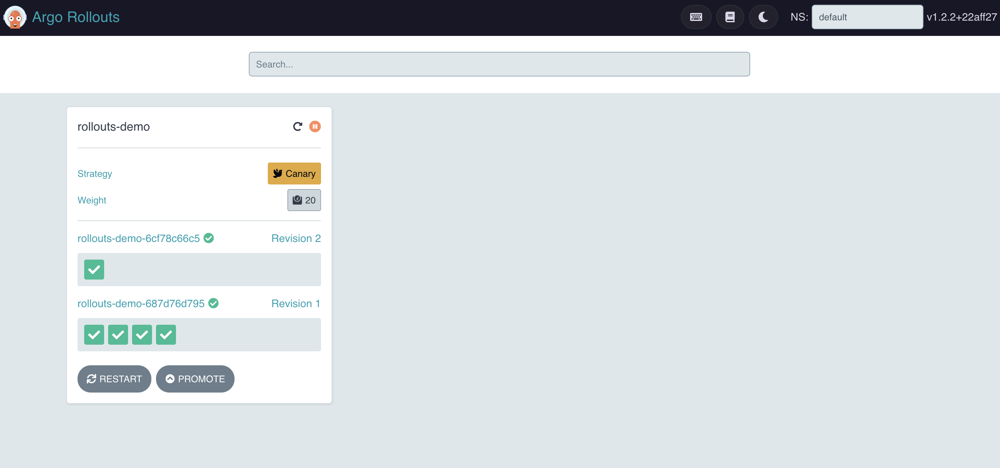
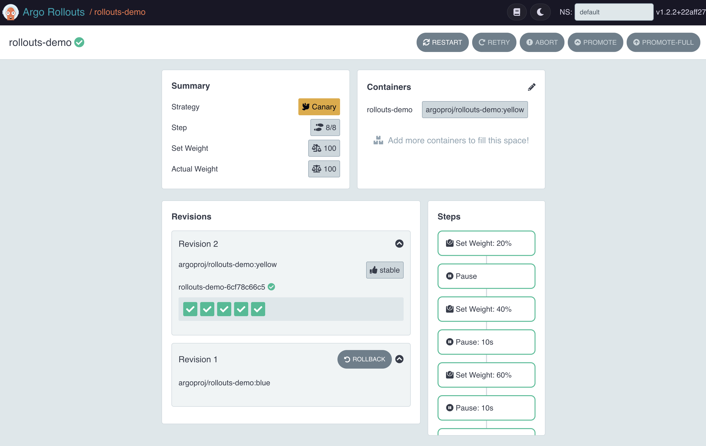

### Argo UI Dashboard
We can run the dashboard via `Argo Rollouts Kubectl plugin` and it provides a local UI to visualize all your `rollouts`.

Start the dashboard and then visit this [`url`](http://localhost:3100)
```bash
kubectl argo rollouts dashboard
```


The dashboard presents 2 views:
- List view where every rollout is displayed
- Individual view where you can drill down a specific rollout and see more details related to it

**Rollout view:**

