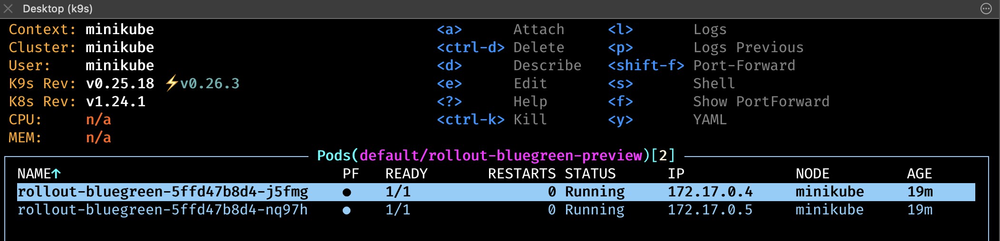

### Deployment strategy
A further strategy handled by Argo Rollouts is `Bluegreen` along with `Canary` which we have already kind of seen during the [`getting started`](../01-getting-started/Readme.md#getting-started) section.
We will deepen both thought this section.

---

***Notes:*** \
In case your `Argo Rollouts Controller` has not been installed yet or uninstalled for some reason
go to this [`folder`](../01-getting-started/) and run the following make command:
```bash 
make argo_rollouts_controller_install
```
or better yet you know what, for commodity, we wrote a specific make target for this lab relying on the target mentioned above found in that directory, so you don't have to switch folder:
```bash 
make argo_rollouts_controller_install
```
---

### BlueGreen deployment strategy

`BlueGreen` deployment is a strategy in which you create 2 separate environments. \
* `blue`  which is running the `current` application version 
* `green` which is running the `new` application version

Using this deployment strategy increases application availability and reduces deployment risk since you might simply rollback the process in case the `new version` fails for whichever reason. \
The process consists in testing the `green` environment and once it is considered good to go, this has to be promoted so ***live traffic*** is directed towards the `new version` and consequently the prior one will be deprecated.

Let's install now the following resources:
* `rollout/rollout-bluegreen`
* `service/rollout-bluegreen-active`
* `service/rollout-bluegreen-preview`

via this command:
```bash
make argo_rollouts_demo_bluegreen_install
```

***`rollout/rollout-bluegreen:`***
```yaml
...
kind: Rollout
metadata:
  name: rollout-bluegreen
spec:
  template:
    ...
    spec:
      containers:
      - name: rollouts-demo
        image: argoproj/rollouts-demo:blue
        ...
  strategy:
    blueGreen: 
      ...
      activeService: rollout-bluegreen-active
      ...
      previewService: rollout-bluegreen-preview
      ...
```

***`service/rollout-bluegreen-active` and `service/rollout-bluegreen-preview`:***
```yaml
kind: Service
metadata:
  name: rollout-bluegreen-active
spec:
  selector:
    app: rollout-bluegreen
  ...
---
kind: Service
metadata:
  name: rollout-bluegreen-preview
spec:
  selector:
    app: rollout-bluegreen
  ...
```

Let's have a look at the `services` which we have been just created:


and we can see that they all refer to the same pods behind:



In fact if we instantiate a port forwarding for both we can see that:

```bash
kubectl port-forward service/rollout-bluegreen-active 8081:80
```

```bash
kubectl port-forward service/rollout-bluegreen-preview 8082:80
```

---
***Notes:*** \
We might have done the same things straight to the pods, just for the sake of simplicity (pods have hashes within their name), we did that :-).

---

* [`url rollout-bluegreen-active`](http://localhost:8081/)

* [`url rollout-bluegreen-preview`](http://localhost:8082/)


Now let's update the `rollout` in order to make `Argo Rollouts` update the new version:

---
***Notes:***
Kill the previous port-forward and instantiate again so you can see the new version published

---

```bash
kubectl argo rollouts set image rollout-bluegreen \
rollouts-demo=argoproj/rollouts-demo:yellow
```

[`rollout-bluegreen-preview`](http://localhost:8082/)


```bash
kubectl argo rollouts promote rollout-bluegreen
```

After that we can tell that they both refer to the same version (i.e. the yellow one). \
In order to verify that, yet again, kill your port-forward for both services and instantiate them again. \
Then you will see both service pointing at the same promoted version which, in this case, is the yellow one, `rollouts-demo:yellow`.

### Canary deployment strategy

`Canary` deployment is a strategy that releases an application incrementally to a subset of users or more generically to a percentage of traffic. \
Canary release is the lowest ***risk-prone*** if we compare to the other deployment strategy such as `BlueGreen` due to its mechanism where you are able to introduce your `new version` little by little incrementing the percentage of live traffic declaring thresholds (e.g: `15%`, `25%`, `75%`, `100%`).


Let's install now the following resources:
* `rollout/rollout-stable`
* `rollout/rollout-canary`
* `service/rollouts-demo`

via this command:
```bash
make argo_rollouts_demo_canary_install
```

Watching the `rollout` via this command

```bash
kubectl argo rollouts get rollout rollouts-demo --watch
```
we can see that now we have just one revision pointing at `argoproj/rollouts-demo:blue` application image:


So let's update the rollout varying the image:
```bash
kubectl argo rollouts set image rollouts-demo \
	rollouts-demo=argoproj/rollouts-demo:yellow
```

After that below the `rollout` state:


Presenting 2 revisions, one referring to the `current/stable version` and the second referring to `canary/new version`, the one we have just sent as image update.

