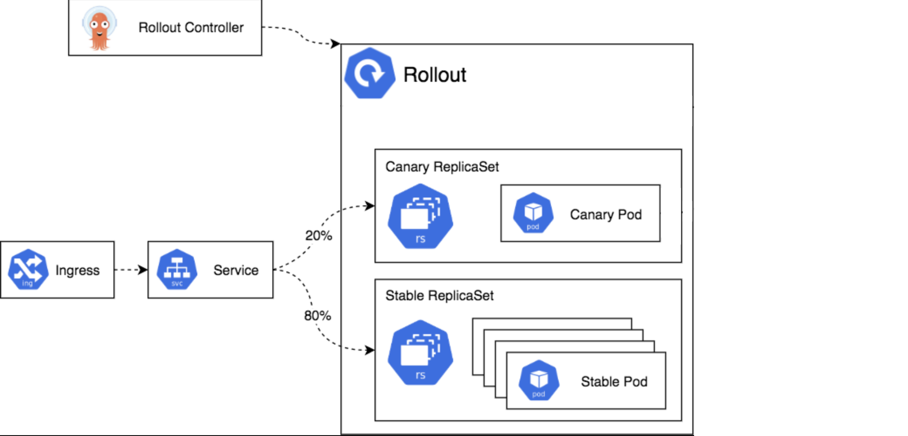

### Argo Rollouts Architecture

This chapter is meant to be an architecture overview about `Argo Rollouts`'s components and their responsibility. Describing in this case a `canary scenario`.

### Argo Rollouts controller
`Argo Rollouts controller` represents the main components. It monitors the cluster for events that involve any `Rollout` custom resource definition instance.
Of course as every controller even in this case is responsible to keep the requested in the `rollout` definition. Just to make it clear, `Argo Rollouts controller` as said, will be responsible only for `rollout` resources, therefore it won't take care of any plan k8s [`deployment`](https://kubernetes.io/docs/concepts/workloads/controllers/deployment/)

### Rollout resource
The `rollout` is a custom resource which belongs to `Argo Rollout`. It is compatible with `native/plane k8s deployment` but enriched with some additional fields in order to manage:
* stage
* thresholds
* deployment strategy such as `canary` and `bluegreen`

### ReplicaSet
`Argo Rollouts` relies on the native [`ReplicaSet`](https://kubernetes.io/docs/concepts/workloads/controllers/replicaset/) which `Argo Rollout` decorates with some additional fields mainly to keep track of different `versions/revisions` overtime, for the rollout lifetime, being also possible to declare with which retention (i.e. last 2 revision).

### Ingress and Service
`Argo Rollouts` relies on the native [`Service`](https://kubernetes.io/docs/concepts/services-networking/service/). This is the live traffic mechanism which allow users to be redirected to the proper version/revision.